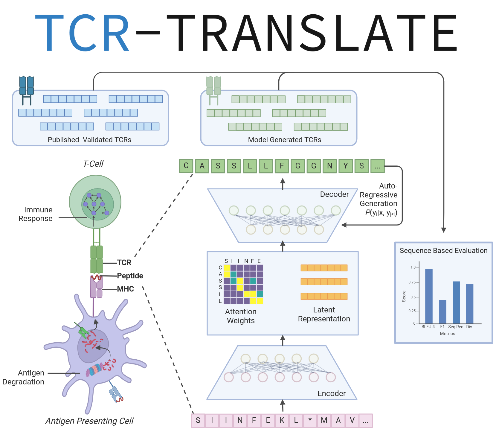

# TCR-TRANSLATE: Conditional Generation of Real Antigen Specific T-cell Receptor Sequences

[](https://doi.org/10.5281/zenodo.15068618)
[](https://doi.org/10.1101/2024.11.11.623124)

In this work, we present a novel framework for addressing the task of antigen-specific TCR design in the face
of a well known data sparsity issue that has hindered numerous efforts at modeling TCR:pMHC specificity. 
We apply techniques from low-resourced machine translation to standard sequence-to-sequence modeling, including data augmentation, 
joint pre-training, and bidirectional training, to boost the sampling of experimentally validated antigen-specific TCRs. 
By constructing a target-rich validation set on well studied epitopes, we release TCRT5, a T5-based model that performed well on accuracy and diversity
metrics. The model demonstrated remarkable generalization capability, successfully generating valid CDR3b sequences for epitopes outside 
its training distribution. While the current implementation establishes the capacity of seq2seq models to recapitulate accurate 
TCR sequence information by focusing on the functionally diverse CDR3b sequences, we hope to apply this framework for computational 
whole receptor TCR design that can significantly accelerate therapeutic development pipelines.



### How to use

This repository contains the raw data, results, and code for training and evaluating our flagship TCRT5 (finetuned) model. Typcial installation can be done using pip. Installation should take only a few minutes. If you would like to use our model directly, we make our model available on HuggingFace's model hub. You can find the models here: 
 
 * [TCRT5 (finetuned)](https://huggingface.co/dkarthikeyan1/tcrt5_ft_tcrdb)
 * [TCRT5 (pre-trained)](https://huggingface.co/dkarthikeyan1/tcrt5_pre_tcrdb)

Additional models will be released as they are evaluated and deemed useful. Please check this 
[HuggingFace collection](https://huggingface.co/collections/dkarthikeyan1/tcr-translate-672d0c28f20af220669d073c) for the latest.
 
### Model Usage

You can use this model directly for conditional CDR3b generation in a few seconds (scales with the number of beams searched):

```python
import re
from transformers import T5Tokenizer, T5ForConditionalGeneration
tokenizer = T5Tokenizer.from_pretrained('dkarthikeyan1/tcrt5_ft_tcrdb')
tcrt5 = T5ForConditionalGeneration.from_pretrained("dkarthikeyan1/tcrt5_ft_tcrdb")
pmhc = "[PMHC]KLGGALQAK[SEP]YFAMYQENVAQTDVDTLYIIYRDYTWAELAYTWY[EOS]"
encoded_pmhc = tokenizer(pmhc, return_tensors='pt')

# Define the number of TCRs you would like to generate ()
num_tcrs = 10
# Define the number of beams to explore (recommended: 3x the number of TCRs)
num_beams = 30

outputs = tcrt5.generate(**encoded_pmhc, max_new_tokens=25, num_return_sequences=num_tcrs, num_beams=num_beams, return_dict_in_generate=True)

# Use regex to get out the [TCR] tag
cdr3b_sequences = [re.sub(r'\[.*\]', '', x) for x in tokenizer.batch_decode(outputs['sequences'], skip_special_tokens=True)]

>>> cdr3b_sequences

['CASSLGTGGTDTQYF',
 'CASSPGTGGTDTQYF',
 'CASSLGQGGTEAFF',
 'CASSVGTGGTDTQYF',
 'CASSLGTGGSYEQYF',
 'CASSPGQGGTEAFF',
 'CASSSGTGGTDTQYF',
 'CASSLGGGGTDTQYF',
 'CASSLGGGSYEQYF',
 'CASSLGTGGNQPQHF']
```

This model can also be used for unconditional generation of CDR3b sequences:

```python
import re
from transformers import T5Tokenizer, T5ForConditionalGeneration
tokenizer = T5Tokenizer.from_pretrained('dkarthikeyan1/tcrt5_ft_tcrdb')
tcrt5 = T5ForConditionalGeneration.from_pretrained("dkarthikeyan1/tcrt5_ft_tcrdb")


# Define the number of TCRs you would like to generate ()
num_tcrs = 10
# Define the number of beams to explore (recommended: 3x the number of TCRs)
num_beams = 30

unconditional_outputs = tcrt5.generate(max_new_tokens=25, num_return_sequences=num_tcrs, num_beams=num_beams, return_dict_in_generate=True)

# Use regex to get out the [TCR] tag
uncond_cdr3b_sequences = [re.sub(r'\[.*\]', '', x) for x in tokenizer.batch_decode(unconditional_outputs['sequences'], skip_special_tokens=True)]

>>> uncond_cdr3b_sequences

['CASSLGGETQYF',
 'CASSLGQGNTEAFF',
 'CASSLGQGNTGELFF',
 'CASSLGTSGTDTQYF',
 'CASSLGLAGSYNEQFF',
 'CASSLGLAGTDTQYF',
 'CASSLGQGYEQYF',
 'CASSLGLAGGNTGELFF',
 'CASSLGGTGELFF',
 'CASSLGQGAYEQYF']
```

If you would like to see a more detailed demo of our model, please check out our Colab notebook [Coming Soon](google.com).

### Contributing

We are currently in the process of making the evaluation code less HuggingFace specific and more modular. If you would like to contribute, please reach out to us at dkarthikeyan1@unc.edu
with a brief description of your background and how you would like to contribute. Alternatively, if you have any feature requests or bug reports, please open an issue on this repository.
Thank you!

### Contact

For more information please reach out to us at: {dkarthikeyan1, alex.rubinsteyn}@unc.edu

### Citation

```
@article{dkarthikeyan2024tcrtranslate,
title={TCR-TRANSLATE: Conditional Generation of Real Antigen-Specific T-cell Receptor Sequences},
author={Dhuvarakesh Karthikeyan and Colin Raffel and Benjamin Vincent and Alex Rubinsteyn},
journal={bioArXiv},
year={2024},
}
```
